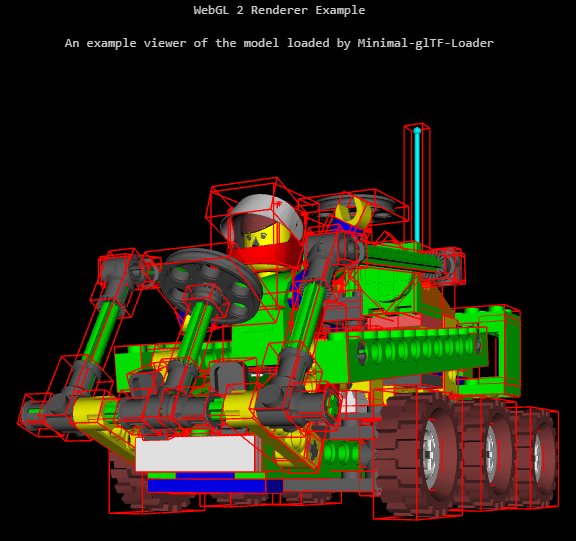

# minimal-gltf-loader
[](https://travis-ci.org/shrekshao/minimal-gltf-loader)
[](https://github.com/shrekshao/minimal-gltf-loader/blob/master/LICENSE.md)

A minimal, engine-agnostic JavaScript glTF Loader, with a raw WebGL 2 simple renderer example using the loader.

## Viewer Screenshot




## Live Demo

[click here for live demo](https://shrekshao.github.io/minimal-gltf-loader/examples/webgl2-renderer.html)

# Usage

```javascript
import {vec3, vec4, quat, mat4} from 'gl-matrix';
var MinimalGLTFLoader = require('build/minimal-gltf-loader.js');

var glTFLoader = new MinimalGLTFLoader.glTFLoader();
glTFLoader.loadGLTF(url, function(glTF){
    //...
});
```


## Loading Features

* [x] Accessors
    - [ ] Progressive loading / rendering
* [x] Buffers
* [x] BufferViews
* [x] Images
* [x] Meshes
* [x] Nodes
* [x] Primitives
* [x] Samplers
* [x] Textures
* [x] ~~Shader Loader~~ (not part of the core of glTF 2.0)
* [x] Animations
* [x] Cameras
* [x] Materials
* [x] Skins

## Formats

* [x] glTF (.gltf) with separate resources: .bin (geometry, animation, skins), .glsl (shaders), and image files
* [ ] glTF (.gltf) with embedded resources
* [ ] Binary glTF (.glb) using the [KHR_binary_glTF](https://github.com/KhronosGroup/glTF/blob/master/extensions/Khronos/KHR_binary_glTF/README.md) extension

## Examples

* [x] WebGL 2 simple renderer
    * [x] baseColorFactor
    * [x] baseColorTexture
    * [x] normalTexture
    * [x] Skybox
    * [x] PBR
    * [x] Animation
    * [ ] Interpolations
        - [x] LINEAR
        - [ ] STEP
        - [ ] CATMULLROMSPLINE
        - [ ] CUBICSPLINE
    * [x] Skin
    * [ ] Camera (from glTF)
    * [ ] Progressive rendering (No plan for this)
    * [ ] Occlusion Culling experiment 
        * [x] Bounding Box
            * [x] AABB (Axis Aligned Bounding Box, *static)
            * [x] OBB (Object/Oriented Bounding Box)
        * [x] Scene Bounding Box (fast iterated) And auto centered and scaled
        * [ ] Build octree
        * [ ] Occlusion Query with hierarchy


## Credits

* [glTF sample Model](https://github.com/KhronosGroup/glTF-Sample-Models) and [Buster Drone By LaVADraGoN](https://sketchfab.com/models/294e79652f494130ad2ab00a13fdbafd)
* Great thanks to Trung Le ([@trungtle](https://github.com/trungtle)) and Patrick Cozzi ([@pjcozzi](https://github.com/pjcozzi)) for contributing and advising. 
* gl-Matrix by Brandon Jones ([@toji](https://github.com/toji)) and Colin MacKenzie IV ([@sinisterchipmunk](https://github.com/sinisterchipmunk))
* [glTF-WebGL-PBR](https://github.com/KhronosGroup/glTF-WebGL-PBR)


---
# minimal-gltf-loader-typescript

A minimal, engine-agnostic TypeScript glTF Loader.

## What's new in gltf-loader-typescript

This loader is a new instance of the minimal-gltf-loader. 

In this branch, the author updated the loading file fuction from XMLHttpRequest to fetch API and used Promise and async/await to make loading procedure much more clearer.

In glTF 2.0 standard, the target attribute on bufferView is optional. Different 3D softwares have different interpretation of glTF exporter.
For instance, the glTF files exported by Cinema4D have filled target attribute, but those exported by Blender 2.80+ **will NOT** have the target attribute filled. (Can see the issue in the following link:
[KhronosGroup/glTF-Blender-IO#142](https://github.com/KhronosGroup/glTF-Blender-IO/issues/142))
Therefore, before binding buffer, the loader should infer the target attribute is whether ARRAY_BUFFER or ELEMENT_ARRAY_BUFFER accoring to the usage of bufferview.
## Usage

```typescript
import {vec3, vec4, quat, mat4} from 'gl-matrix';
import {GLTFLoader, GLTF} from './src/glTFLoader.ts'

let gl : WebGLRenderingContext | WebGL2RenderingContext;

new GLTFLoader(gl).loadGLTF('YourURL').then((glTF: GLTF) => {
    // Create with glTF object, and proceed rendering process...
}).catch (() => {
    // Error control...
});
```