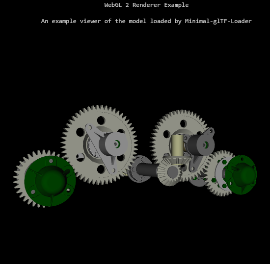
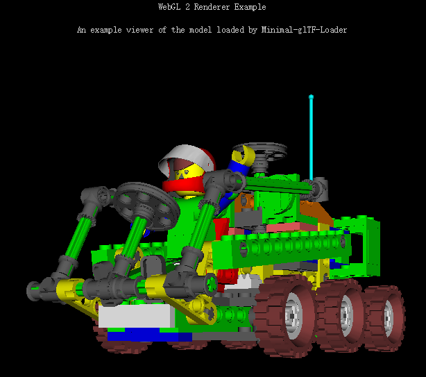

# minimal-gltf-loader

A minimal JavaScript glTF Loader without need of support from 3D engines like Three.js. 

(:exclamation: In development, newly migrate to glTF 2, not backward compatible for now, really feature incomplete for now -_-)

## Viewer Screenshot

## Features

* [x] Geometry Loader
* [x] Image Loader
* [x] ~~Shader Loader~~ (not part of the core of glTF 2.0)
* [ ] Animation
* [ ] Skins

## Formats

* [x] glTF (.gltf) with separate resources: .bin (geometry, animation, skins), .glsl (shaders), and image files
* [ ] glTF (.gltf) with embedded resources
* [ ] Binary glTF (.glb) using the [KHR_binary_glTF](https://github.com/KhronosGroup/glTF/blob/master/extensions/Khronos/KHR_binary_glTF/README.md) extension
* [ ] glTF (.gltf) using the [KHR_materials_common](https://github.com/KhronosGroup/glTF/blob/master/extensions/Khronos/KHR_materials_common/README.md) extension

## Examples

* [x] WebGL 2 simple renderer
    * [x] baseColor
    * [ ] PBR
    * [ ] Animation
    * [ ] Occlusion Culling experiment 
        * [x] Bounding Box (fast iterated)
        * [ ] Build octree
        * [ ] Occlusion Query with hierarchy

## Credits

* [glTF sample Model](https://github.com/KhronosGroup/glTF-Sample-Models)
* Great thanks to Trung Le ([@trungtle](https://github.com/trungtle)) and Patrick Cozzi ([@pjcozzi](https://github.com/pjcozzi)) for contributing and advising. 
* gl-Matrix by Brandon Jones ([@toji](https://github.com/toji)) and Colin MacKenzie IV ([@sinisterchipmunk](https://github.com/sinisterchipmunk))